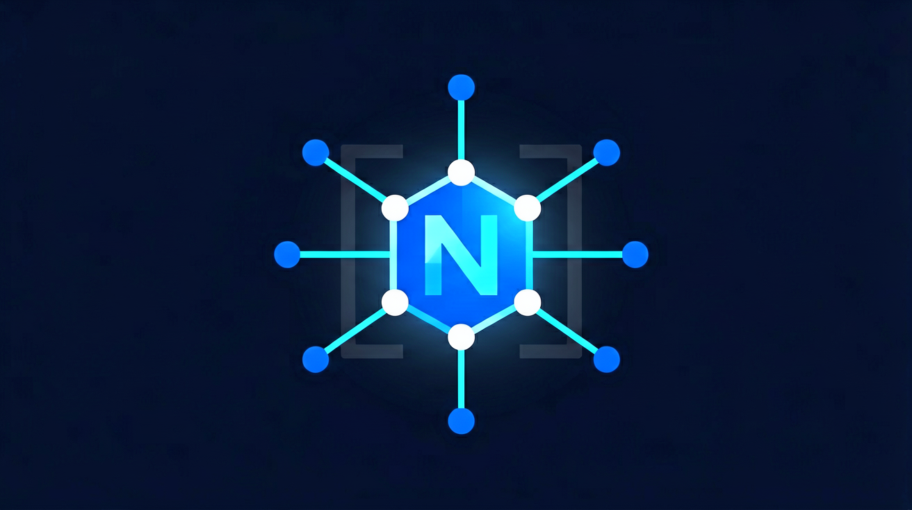

<p align="center">
  
</p>

<p align="center">
  <a href="https://www.python.org/downloads/"></a>
  <a href="https://nornir.readthedocs.io/"></a>
  <a href="https://napalm.readthedocs.io/"></a>
  <a href="https://opensource.org/licenses/MIT"></a>
  <a href="https://github.com/sydasif/nornir-napalm-mcp"></a>
</p>

# Nornir-NAPALM FastMCP Server

A FastMCP server that exposes live network device state to AI assistants via NAPALM getters. Nornir handles inventory loading and concurrent device connections over SSH, eAPI, and NETCONF.

All operations are **read-only** — no configuration push is exposed.

---

## Features

| Tool                      | Description                                                                 |
| ------------------------- | --------------------------------------------------------------------------- |
| `nornir_list_inventory`   | List all devices with hostname, platform, and group membership              |
| `nornir_get_facts`        | System facts: vendor, model, OS version, serial number                      |
| `nornir_run_getter`       | Run any NAPALM getter by name (`arp_table`, `bgp_neighbors`, `vlans`, etc.) |
| `nornir_get_config`       | Retrieve running and/or startup configuration from a device                 |
| `nornir_run_cli`          | Execute read-only CLI commands via NAPALM's CLI method                      |
| `nornir_list_getters`     | Introspect available NAPALM getters for each platform in the inventory      |
| `nornir_reload_inventory` | Re-read YAML inventory from disk                                            |

- **Lazy initialization** — server starts even with a broken inventory, exposing the tool catalogue for inspection.
- **Singleton caching** — Nornir instance is initialized once and reused across requests.
- **Flexible filtering** — filter by device name, group, or platform on any tool.
- **SSE and STDIO transport** — run locally for Claude Desktop or expose over HTTP.

---

## Setup

### Nornir configuration

The server requires a Nornir configuration file, provided via the `NORNIR_CONFIG` environment variable.

#### Configuration Setup

- Copy the included example config to the project root (or any path you prefer):

```bash
cp config.example.yaml config.yaml
```

- Edit `config.yaml` to point at your inventory files. A minimal config looks like:

```yaml
---
inventory:
  plugin: SimpleInventory
  options:
    host_file: "inventory/hosts.yaml"
    group_file: "inventory/groups.yaml"
    defaults_file: "inventory/defaults.yaml"

runner:
  plugin: threaded
  options:
    num_workers: 10

logging:
  enabled: false
```

_Note: The inventory files referenced must exist relative to this config file._

---

### MCP client configuration

Register this server with any MCP client (Claude Desktop, VS Code, etc.) by adding the following to your project's `.mcp.json`:

#### uvx from GitHub (recommended)

```json
{
  "mcpServers": {
    "nornir": {
      "command": "uvx",
      "args": [
        "--from",
        "git+https://github.com/<your-user>/nornir-napalm-mcp",
        "nornir-napalm-mcp"
      ],
      "env": {
        "NORNIR_CONFIG": "/absolute/path/to/config.yaml"
      }
    }
  }
}
```

### Environment variables

| Variable        | Default      | Description                         |
| --------------- | ------------ | ----------------------------------- |
| `NORNIR_CONFIG` | — (required) | Path to the Nornir bootstrap config |

---

### NAPALM getters

Use `nornir_run_getter` with any of these:

| Getter                  | Description                                      |
| ----------------------- | ------------------------------------------------ |
| `arp_table`             | ARP table                                        |
| `bgp_config`            | BGP running configuration                        |
| `bgp_neighbors`         | BGP neighbors summary                            |
| `bgp_neighbors_detail`  | BGP neighbors detailed                           |
| `config`                | Running/startup/candidate configuration          |
| `facts`                 | System facts (vendor, model, OS, serial, uptime) |
| `interfaces`            | Interface status and details                     |
| `interfaces_ip`         | IP addresses on interfaces                       |
| `lldp_neighbors`        | LLDP neighbors summary                           |
| `lldp_neighbors_detail` | LLDP neighbors detailed                          |
| `mac_address_table`     | MAC address table                                |
| `ntp_servers`           | NTP server configuration                         |
| `snmp_information`      | SNMP configuration                               |
| `vlans`                 | VLAN information                                 |

---

## Project Structure

```bash
nornir-napalm-mcp/
├── nornir_napalm_mcp/
│   ├── __init__.py      # Package version
│   ├── __main__.py      # python -m support
│   ├── models.py        # Pydantic data models (InventoryDevice, GetterInfo)
│   ├── runner.py        # Nornir initialization and caching
│   └── server.py        # FastMCP server and tool definitions
├── tests/
│   ├── conftest.py      # Fake Nornir stubs and fixtures
│   └── test_helpers.py  # Unit tests for all tools
├── pyproject.toml       # Build config, dependencies, tool settings
└── README.md
```

---

## Development

```bash
# Run tests
uv run pytest

# Lint
uv run ruff check .

# Type check (strict mode)
uv run mypy .

# Build wheel
uv build

# Install from GitHub with uvx
uvx --from "git+https://github.com/<your-user>/nornir-napalm-mcp" nornir-napalm-mcp
```

---

## Companion Lab

- To test the tools, you can use the [netlab-demo](https://github.com/sydasif/netlab-demo.git) test lab with Cisco devices.
