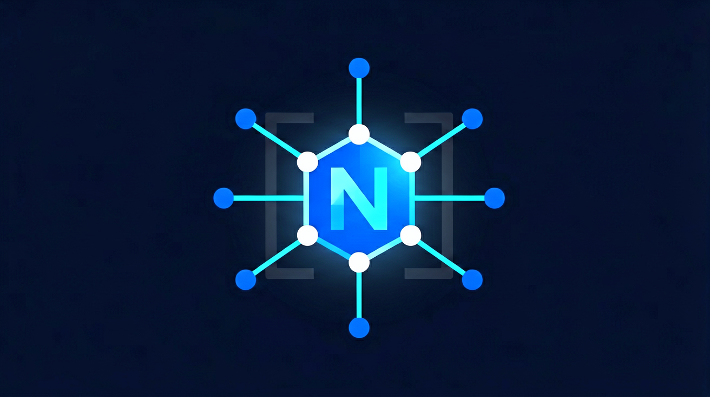

<p align="center">
  
</p>

<p align="center">
  <a href="https://www.python.org/downloads/"></a>
  <a href="https://nornir.readthedocs.io/"></a>
  <a href="https://napalm.readthedocs.io/"></a>
  <a href="https://github.com/ktbyers/netmiko"></a>
  <a href="https://opensource.org/licenses/MIT"></a>
  <a href="https://github.com/sydasif/nornir-napalm-mcp"></a>
</p>

# Nornir-NAPALM-Netmiko FastMCP Server

A FastMCP server that exposes live network device state to AI assistants via NAPALM getters and netmiko CLI commands. Nornir handles inventory loading and concurrent device connections; NAPALM drives the read/getter tools and netmiko drives the CLI read + write-path tools.

Reads are free; **writes are gated**. `nornir_apply_config` (dry-run by default) and `nornir_save_config` are the only tools that touch device state, and every write is policy-screened, pre-change-backed up (fail-closed), transcript-parsed, and audit-logged. Every response is a structured envelope with an explicit success flag (spec §21).

> **Developers and AI agents**: architecture, invariants, testing anchors, and
> verification gates live in [`CLAUDE.md`](CLAUDE.md). This README is the
> user-facing reference: features, setup, usage, and the dev workflow.

---

## Features

| Tool                      | Description                                                                 |
| ------------------------- | --------------------------------------------------------------------------- |
| `nornir_list_inventory`   | List all devices with hostname, platform, and group membership              |
| `nornir_get_facts`        | System facts: vendor, model, OS version, serial number                      |
| `nornir_run_getter`       | Run any NAPALM getter by name (`arp_table`, `bgp_neighbors`, `vlans`, etc.) |
| `nornir_get_config`       | Retrieve running and/or startup configuration from a device                 |
| `nornir_list_getters`     | Introspect available NAPALM getters for each platform in the inventory      |
| `nornir_reload_inventory` | Re-read YAML inventory from disk                                            |
| `nornir_run_command`      | Run one read-only netmiko CLI command (READ_ONLY/SAFE_OPERATIONAL only, per device)  |
| `nornir_run_commands`     | Run a batch of read-only netmiko CLI commands; rejected commands fail only themselves |
| `nornir_backup_config`    | Capture and store the running config as an immutable backup (NAPALM, falling back to netmiko) |
| `nornir_list_backups`     | List stored backups for a device, oldest first                              |
| `nornir_apply_config`     | Plan (dry-run by default) and apply config lines via netmiko; pre-change backups are mandatory and fail-closed |
| `nornir_save_config`      | Persist running config to startup/NVRAM via netmiko — explicit-only, never called implicitly by apply (spec §11) |

- **Writes are gated.** `nornir_apply_config` and `nornir_save_config` are the only write tools. Apply dry-runs by default, rejects DANGEROUS/BLOCKED lines per device, always captures a pre-change backup (fail-closed: a failed backup means the device is never touched), and reports transcript errors honestly. Saving to NVRAM is a separate, explicit, audited step.
- **Lazy initialization** — server starts even with a broken inventory, exposing the tool catalogue for inspection.
- **Singleton caching** — Nornir instance is initialized once and reused across requests. Failed-device quarantine (`failed_hosts`) is reset before every call so dropped devices are available again on the next request.
- **Flexible filtering** — filter by device name, group, or platform on any tool.
- **HTTP and STDIO transport** — run locally for Claude Desktop or expose over HTTP.

## Safety model

Every CLI command routed through netmiko is classified into one of six categories per platform (`ios` / `eos` rulesets — anything else defaults to UNKNOWN and is denied):

| Category | Read tools (`nornir_run_command*`) | Apply (`nornir_apply_config`) |
| -------- | --------------------------------- | ----------------------------- |
| `READ_ONLY` (`show …`) | ✅ allowed | allowed |
| `SAFE_OPERATIONAL` (`ping`, `traceroute`) | ✅ allowed | allowed |
| `CONFIGURATION` (`interface`, `ip route`, …) | ❌ rejected | ✅ allowed |
| `UNKNOWN` | ❌ rejected (deny by default) | ✅ allowed (fails on-device if bad) |
| `DANGEROUS` (`reload`) | ❌ rejected | ❌ rejected |
| `BLOCKED` (`write erase`, `wr e`, …) | ❌ rejected | ❌ rejected |

- Abbreviated forms (`wr e`, `conf t`, `rel`) are expanded before classification — abbreviated and full forms behave identically.
- Newline/control-character injection is **structurally impossible**: multi-line input is rejected before any device is touched.
- Every change gets an immutable pre-change backup (0600 perms, sha256 sidecar) — if the backup fails, the device is never touched. Backups are the rollback substrate for a future rollback tool.
- Applied configs are transcript-parsed heuristically; a detected device error is never reported as success, and `device_state` stays honestly "unknown" (no read-back in v1).
- All writes are appended to an audit log with change ids and sha256 hashes — never config text.

## Prerequisites

| Requirement              | Version         | Notes                                                                                            |
| ------------------------ | --------------- | ------------------------------------------------------------------------------------------------ |
| Python                   | 3.12+           | Required for type hint syntax and pathlib improvements                                           |
| uv                       | latest          | Recommended package manager ([install](https://docs.astral.sh/uv/getting-started/installation/)) |
| NAPALM-supported devices | Vendor-specific | SSH, eAPI, or NETCONF access to target devices                                                   |

---

## Setup

### Nornir configuration

The server requires a Nornir configuration file, provided via the `NORNIR_CONFIG` environment variable.

#### Configuration Setup

- Copy the included example config to the project root (or any path you prefer):

```bash
cp config.example.yaml config.yaml
```

- Edit `config.yaml` to point at your inventory files. A minimal config looks like:

```yaml
---
inventory:
  plugin: SimpleInventory
  options:
    host_file: "inventory/hosts.yaml"
    group_file: "inventory/groups.yaml"
    defaults_file: "inventory/defaults.yaml"

runner:
  plugin: threaded
  options:
    num_workers: 10

logging:
  enabled: false
```

_Note: The inventory files referenced must exist relative to this config file._

---

### Quickstart: run from GitHub with uvx

No clone or virtualenv needed — `uvx` downloads the package from GitHub and runs it on the spot. Point `NORNIR_CONFIG` at your config (above) and:

```bash
# STDIO transport (default)
NORNIR_CONFIG=/path/to/config.yaml uvx --from "git+https://github.com/sydasif/nornir-napalm-mcp" nornir-mcp

# HTTP transport
NORNIR_CONFIG=/path/to/config.yaml uvx --from "git+https://github.com/sydasif/nornir-napalm-mcp" nornir-mcp --transport http --host 0.0.0.0 --port 8000
```

For a persistent install, use `uv tool install` once, then run `nornir-mcp` like any other command:

```bash
uv tool install --from "git+https://github.com/sydasif/nornir-napalm-mcp" nornir-mcp
NORNIR_CONFIG=/path/to/config.yaml nornir-mcp
```

To pin a specific revision, append `@<ref>` (a tag or commit hash) to the URL, e.g. `git+https://github.com/sydasif/nornir-napalm-mcp@<commit-sha>`.

---

### MCP client configuration

Register this server with any MCP client (Claude Desktop, VS Code, etc.) by adding the following to your project's `.mcp.json`:

#### uvx from GitHub (recommended)

```json
{
  "mcpServers": {
    "nornir": {
      "command": "uvx",
      "args": [
        "--from",
        "git+https://github.com/sydasif/nornir-napalm-mcp",
        "nornir-mcp"
      ],
      "env": {
        "NORNIR_CONFIG": "/absolute/path/to/config.yaml"
      }
    }
  }
}
```

### Environment variables

| Variable                    | Default        | Description                                    |
| --------------------------- | -------------- | ---------------------------------------------- |
| `NORNIR_CONFIG`             | — (required)   | Path to the Nornir bootstrap config            |
| `NORNIR_MCP_BACKUP_DIR`     | `./backups`    | Root directory for immutable backups           |
| `NORNIR_MCP_AUDIT_DIR`      | `./audit`      | Root directory for the append-only audit log   |
| `NORNIR_MCP_MAX_OUTPUT_BYTES` | `65536`      | Per-output truncation budget (spec §21.1)      |

---

### NAPALM getters

Use `nornir_run_getter` with any of these:

| Getter                  | Description                                      |
| ----------------------- | ------------------------------------------------ |
| `arp_table`             | ARP table                                        |
| `bgp_config`            | BGP running configuration                        |
| `bgp_neighbors`         | BGP neighbors summary                            |
| `bgp_neighbors_detail`  | BGP neighbors detailed                           |
| `config`                | Running/startup/candidate configuration          |
| `facts`                 | System facts (vendor, model, OS, serial, uptime) |
| `interfaces`            | Interface status and details                     |
| `interfaces_ip`         | IP addresses on interfaces                       |
| `lldp_neighbors`        | LLDP neighbors summary                           |
| `lldp_neighbors_detail` | LLDP neighbors detailed                          |
| `mac_address_table`     | MAC address table                                |
| `ntp_servers`           | NTP server configuration                         |
| `snmp_information`      | SNMP configuration                               |
| `vlans`                 | VLAN information                                 |

---

## Usage

### CLI help

```bash
uv run nornir-mcp --help
```

_Note: there is no CLI flag for listing inventory — use the `nornir_list_inventory` MCP tool instead._

The commands below assume a local checkout (`uv run nornir-mcp`). Installed from GitHub, replace `uv run nornir-mcp` with the `uvx --from "git+https://github.com/sydasif/nornir-napalm-mcp"` form from the [Quickstart](#quickstart-run-from-github-with-uvx), or run plain `nornir-mcp` after `uv tool install`.

### Run as MCP server (STDIO)

```bash
NORNIR_CONFIG=/path/to/config.yaml uv run nornir-mcp
```

### Run as HTTP server

```bash
NORNIR_CONFIG=/path/to/config.yaml uv run nornir-mcp --transport http --host 0.0.0.0 --port 8000
```

### Run as Python module

```bash
NORNIR_CONFIG=/path/to/config.yaml uv run python -m nornir_mcp
```

---

## Project Structure

```
nornir-mcp/
├── nornir_mcp/
│   ├── __init__.py       # Package version
│   ├── __main__.py       # python -m nornir_mcp support
│   ├── server.py         # Composition root: FastMCP + tool registration (thin)
│   ├── cli/
│   │   └── main.py       # CLI entry point (argparse, transport selection)
│   ├── core/             # Shared kernel — stateless services + CoreBase
│   │   ├── base.py       # CoreBase: envelope/selection plumbing shared by all tools
│   │   ├── envelope.py   # ToolEnvelope / HostOutcome / StructuredError + truncation
│   │   ├── errors.py     # Categorized exceptions (McpError, ErrorType) with retryable policy
│   │   ├── policy.py     # Command canonicalization + classification (READ/SAFE/CONFIG/DANGEROUS/BLOCKED/UNKNOWN)
│   │   ├── capability.py # Platform capability gate (netmiko device-type mapping)
│   │   ├── storage.py    # Immutable backup storage (0600 files, sha256 sidecars, traversal-safe)
│   │   ├── audit.py      # Append-only JSONL audit logger (hashes only, never config text)
│   │   ├── runner.py     # Nornir init, config loading, singleton caching, execution lock, NornirLike protocol
│   │   └── tasks.py      # Task helpers: device filtering, execution, outcome normalization
│   ├── tools/
│   │   ├── base/         # NornirBase: engine-agnostic server tools (inventory, reload, backups)
│   │   │   ├── tool.py   # NornirBase(CoreBase) — 4 server tools + InventoryDevice model
│   │   │   └── capture.py # Config-capture service (NAPALM preferred, netmiko fallback)
│   │   ├── napalm/       # NapalmTool: NAPALM-family tools
│   │   │   ├── tool.py   # NapalmTool(NornirBase) — 4 NAPALM tools
│   │   │   └── introspection.py # NAPALM getter discovery per platform (GetterInfo)
│   │   └── netmiko/      # NetmikoTool: CLI read + write-path tools
│   │       ├── tool.py   # NetmikoTool(NornirBase) — 4 CLI tools + gating
│   │       └── changes.py # Write-path orchestration: plan, fail-closed backups, dry-run, transcript parse
│   └── py.typed          # PEP 561 marker for downstream type checking
├── tests/
│   ├── conftest.py       # Fake Nornir stubs, fake netmiko tasks, pytest fixtures
│   ├── core/             # Kernel unit tests (envelope, errors, policy, capability, storage, audit, tasks, runner, locking)
│   ├── tools/
│   │   ├── base/test_tool.py       # NornirBase tools (inventory, reload, backups)
│   │   ├── napalm/                 # NapalmTool tools + getter introspection
│   │   └── netmiko/               # NetmikoTool tools + change planning / transcript parsing
│   ├── test_e2e.py       # Full-stack tests through the MCP protocol layer + 12-tool surface pin
│   └── test_cli.py       # CLI entry points
├── config.example.yaml   # Example Nornir configuration
├── pyproject.toml        # Build config, dependencies, and tool settings
├── uv.lock               # Locked dependencies
└── README.md
```

---

## Contributing

### Development workflow

```bash
# Install dependencies
uv sync

# Add a dependency (or dev dependency)
uv add <package>
uv add --dev <package>

# Update the lockfile
uv lock
```

```bash
# Run tests
uv run pytest

# Run tests with coverage
uv run pytest --cov=nornir_mcp --cov-branch

# Lint
uv run ruff check .
uv run ruff check --fix .

# Format
uv run ruff format .
uv run ruff format --check .

# Type check (strict mode)
uv run mypy .

# Dead code scan
uv run vulture nornir_mcp tests --min-confidence 80
```

```bash
# Local dev (MCP Inspector)
fastmcp dev nornir_mcp/server.py

# Claude Desktop install
fastmcp install nornir_mcp/server.py

# Run STDIO transport
nornir-mcp --transport stdio

# Run HTTP transport
nornir-mcp --transport http --host 0.0.0.0 --port 8000
```

### Code standards

- **Python 3.12+** — use modern syntax (f-strings, `match`, `str.removeprefix`)
- **Type hints** — required on all function signatures (`mypy --strict`)
- **Docstrings** — Google-style with `Args:`, `Returns:`, `Raises:`
- **Tests** — AAA pattern, one assertion per logical check, use `pytest` fixtures
- **Linting** — `ruff` with `E`, `F`, `I`, `UP` rules

### Commit conventions

Use [Conventional Commits](https://www.conventionalcommits.org/):

```
feat(server): add nornir_ping tool
fix(runner): handle missing NORNIR_CONFIG gracefully
refactor: extract _run_nornir_task helper
test: add runner config expansion tests
```

---

## Companion Lab

Test against real devices using the [netlab-demo](https://github.com/sydasif/netlab-demo.git) test lab with Cisco devices via Containerlab.

---

## License

MIT
